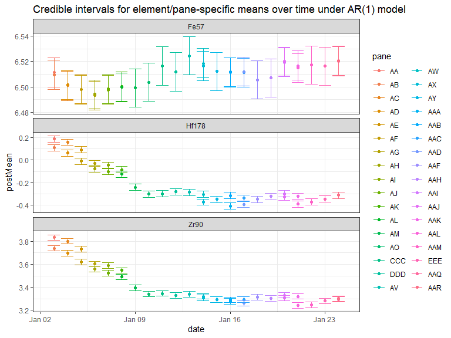
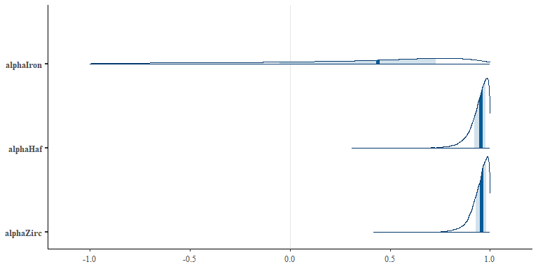

```{r setup, include=FALSE}
options(htmltools.dir.version = FALSE)
knitr::opts_chunk$set(echo = FALSE,message = FALSE,warning = FALSE,fig.align = "center")
library(tidyverse)
library(rstan)
library(bayesplot)

set.seed(4142020)
```

```{r, load_refs, include=FALSE, cache=FALSE}
RefManageR::BibOptions(check.entries = FALSE,
           bib.style = "authoryear",
           cite.style = "alphabetic",
           style = "markdown",
           max.names = 2,
           no.print.fields = c("urldate","file","issn","url","keywords","language","abstract"),
           hyperlink = FALSE,
           dashed = FALSE)
myBib <- RefManageR::ReadBib("./bib/ref.bib", check = FALSE)
```

```{r dataCleaning}
glass <- read_csv("../all_glass.csv") %>%
  select(-X1) %>%
  mutate(pane = factor(x = pane,
                       levels = unique(c(unlist(str_extract_all(pane,pattern = "^A[A-Y]$")),
                                         unlist(str_extract_all(pane,pattern = "^AA[A-R]$")),
                                         unlist(str_extract_all(pane,pattern = "^B[A-Y]$")),
                                         unlist(str_extract_all(pane,pattern = "^BA[A-R]$"))))))

dates <- data.frame(pane = glass %>%
                      pull(pane) %>% 
                      unique(),
                    date = lubridate::mdy(c("1/3/17",
                                            "1/3/17",
                                            "1/4/17",
                                            "1/4/17",
                                            "1/5/17",
                                            "1/5/17",
                                            "1/6/17",
                                            "1/6/17",
                                            "1/7/17",
                                            "1/7/17",
                                            "1/8/17",
                                            "1/8/17",
                                            "1/9/17",
                                            "1/10/17",
                                            "1/13/17",
                                            "1/14/17",
                                            "1/14/17",
                                            "1/15/17",
                                            "1/16/17",
                                            "1/16/17",
                                            "1/17/17",
                                            "1/17/17",
                                            "1/18/17",
                                            "1/19/17",
                                            "1/20/17",
                                            "1/20/17",
                                            "1/21/17",
                                            "1/21/17",
                                            "1/22/17",
                                            "1/24/17",
                                            "1/24/17",
                                            "12/5/16",
                                            "12/5/16",
                                            "12/7/16",
                                            "12/7/16",
                                            "12/7/16",
                                            "12/7/16",
                                            "12/9/16",
                                            "12/9/16",
                                            "12/9/16",
                                            "12/9/16",
                                            "12/12/16",
                                            "12/12/16",
                                            "12/14/16",
                                            "12/15/16",
                                            "12/15/16",
                                            "12/16/16",
                                            "12/16/16")))

glassLong <- glass %>%
  left_join(dates,by = "pane") %>%
  select(-Rep) %>%
  mutate_at(4:21,~ log(.)) %>%
  group_by(Company,pane,fragment) %>%
  summarise_all(.funs = mean) %>%
  filter(Company == "CompanyA") %>%
  ungroup() %>%
  mutate(pane = factor(x = pane,
                       levels = unique(c(unlist(str_extract_all(pane,pattern = "^A[A-Y]$")),
                                         unlist(str_extract_all(pane,pattern = "^AA[A-R]$")))))) %>%
  pivot_longer(cols = 4:21,
               names_to = "element",
               values_to = "concentration") %>%
  select(-Company)

#Pane AAB is missing data from fragments 7 and 9. We can simulate from a normal
#centered at element-specific average and scaled to element-specific sd to fill
#in these missing values (which will really help coding in RSTAN below). The
#commented ggplot call below seems to show that the simulated values tend to be
#in the bulk of the data, which is good

paneAABmissingSim <- glassLong %>%
  filter(pane == "AAB") %>%
  group_by(element) %>%
  summarise(meanConcentration = mean(concentration),
            sdConcentration = sd(concentration)) %>%
  pmap_dfr(~ {
    data.frame(pane = "AAB",
               date = lubridate::ymd("2017-01-16"),
               element = ..1,
               "7" =  rnorm(n = 1,mean = ..2,sd = ..3),
               "9" = rnorm(n = 1,mean = ..2,sd = ..3),
               stringsAsFactors = FALSE)
  }) %>%
  pivot_longer(cols = c(X7,X9),names_to = "fragment",values_to = "concentration") %>%
  mutate(fragment = as.numeric(str_extract(fragment,"7|9")))

glassLong <- bind_rows(glassLong,paneAABmissingSim) %>%
   mutate(pane = factor(x = pane,
                       levels = unique(c(unlist(str_extract_all(pane,pattern = "^A[A-Y]$")),
                                         unlist(str_extract_all(pane,pattern = "^AA[A-R]$"))))))

# glassLong %>%
#   filter(pane == "AAB") %>%
#   mutate(indic = factor(ifelse(fragment == 7 | fragment == 9, 1,0))) %>%
#   ggplot(aes(x = concentration)) +
#   geom_histogram(aes(fill = indic),bins = 24) +
#   facet_wrap(~element,scales = "free")
```


class: inverse, center, middle

# Introduction
---

# Forensic glass evidence

```{r dpi = 260}

```

- Concentration of elements can uniquely identify a pane of glass

.footnote[
[Image Source](https://fineartamerica.com/featured/4-collecting-evidence-tek-image.html)
]

--

- Useful for, e.g., matching a fragment of glass found on suspect to one found on crime scene

--

- How do concentrations vary within manufacturer over time?

???
- The reason why analyzing glass evidence from a forensics standpoint is that a particular pane of glass can be uniquely identified by its chemical makeup.
- So if a shard of glass is found on a suspect that has nearly the same chemical makeup as a shard of glass found at a crime scene, then that would provide evidence that the suspect was at the crime scene at some point.
- An interesting question then to answer is the degree to which panes of glass vary if they came from the same manufacturer. Additionally, if there is any similarity between panes of glass from the same manufacturer that were manufactured at different times.
- This is the focus of the analysis that I performed.

---
class: inverse, center, middle

# Data

---
# Float glass database

- Park & Carriquiry (2018) - panes of *float glass* sampled:

 - 2 manufacturers (Company A and Company B)

 - 3 week and 2 week sampling period, respectivley
 
--

 - 48 5" by 5" panes of glass (31 from A, 17 from B)
 
--

 - 24 fragments taken from each pane
 
--

 - Concentrations of 18 elements repeatedly measured for each fragment
 
     - 5 measurements for 21 fragments, 20 measurements for 3
     - Measured in parts/million (micrograms/gram)
     
--
     
- Concentrations used as features in supervised learning classification algorithms

 - Classify two fragments as "matching" (from same pane) or "non-matching"

???
- Park and Carriquiry collected elemental concentrations from panes of float glass, which is a method by which most modern windows are manufactured.
- They collected panes from two companies, referred to as A and B in the dataset, over a period of 3 weeks and 2 weeks, respectively.
- These "panes" were 5 in. by 5 in. cut pieces of glass - 31 were collected from Company A and 17 from Company B
- To gather elemental concentrations, each pane was broken into fragments. 24 fragments were randomly selected among them.
- For each fragment, the concentration of 18 elements was measured.
- Of the 24 sampled fragments, 21 had their elemental concentrations measure 5 times. 3 had their elemental concentrations 20 times. 
 - This was to ensure a higher level of precision in the measurements.
 - The concentrations were measured in micrograms per gram of glass - or parts/million
- Park and Carriquiry were interested in using these elemental concentrations as features in supervised learning algorithms to classify a pair of fragments as either "matching," meaning they originated from the same pane, or "non-matching," meaning they did not.
 - The goal of this analysis is to analyze the elemental concentrations in a different manner

---
# Data and computational limitations

- Company B panes sampled at infrequent intervals making temporal analysis difficult

```{r warning=FALSE,message=FALSE,echo=FALSE,fig.align='center',fig.height=3}
glass %>%
  left_join(dates,by = "pane") %>%
  select(-Rep) %>%
  mutate_at(4:21,~ log(.)) %>%
  group_by(Company,pane,fragment) %>%
  summarise_all(.funs = mean) %>%
  filter(Company == "CompanyB") %>%
  ungroup() %>%
  mutate(pane = factor(x = pane,
                       levels = unique(c(unlist(str_extract_all(pane,pattern = "^A[A-Y]$")),
                                         unlist(str_extract_all(pane,pattern = "^AA[A-R]$")))))) %>%
  pivot_longer(cols = 4:21,
               names_to = "element",
               values_to = "concentration") %>%
  select(-Company) %>%
  filter(element == "Fe57") %>%
  ggplot() +
  geom_point(aes(x = date,y = concentration),alpha = .5) +
  # geom_line(data = glass %>%
  #             left_join(dates,by = "pane") %>%
  #             select(-Rep) %>%
  #             mutate_at(4:21,~ log(.)) %>%
  #             group_by(Company,pane,fragment) %>%
  #             summarise_all(.funs = mean) %>%
  #             filter(Company == "CompanyB") %>%
  #             ungroup() %>%
  #             mutate(pane = factor(x = pane,
  #                                  levels = unique(c(unlist(str_extract_all(pane,
  #                                                                           pattern = "^A[A-Y]$")),
  #                                                    unlist(str_extract_all(pane,
  #                                                                           pattern = "^AA[A-R]$")))))) %>%
  #             pivot_longer(cols = 4:21,
  #                          names_to = "element",
  #                          values_to = "concentration")%>%
  #             filter(element %in% unique(element)[1]) %>%
  #             group_by(date,element) %>%
  #             summarise(mean_t = mean(concentration)),
  #           aes(x = date,y = mean_t),
  #           size = 1) +
  facet_wrap(~ element,scales = "free_y",nrow = 3) +
  theme_bw() +
  ggtitle("Company B iron concentration over time (log scale)") +
  xlab("Time (days)") +
  ylab("Concentration (parts/million)")
```

- Analyzing concentrations of all 18 elements was computationally infeasible

--

- Settled on 3 elements, Iron, Hafnium, and Zirconium, for all Company A panes

???
- Even with the complicated sampling scheme, there are still some issues with data as they relate to the goals of this Bayesian analysis.
- For one, the panes from Company B were taken at fairly infrequent intervals. An example of the lithium concentrations for various Company B panes are shown. We can see that the observations are fairly spread out and aren't at regular intervals.
- I initially was hoping to analyze all 18 elemental concentrations from both companies. However, this proved to be computationally infeasible.
- Instead, I narrowed the scope of the analysis to only consider 3 elements and only the data from Company A since the Company B data would be extra difficult to deal with. These 3 elements are Iron, Hafnium, and Zirconium

---
# Pane-specific distributions

- Park & Carriquiry (2018) consider `log(concentration)`
 - Also average repeated measurements per fragment 

--
<!-- - $^\text{57}$Fe is Iron, $^\text{178}$Hf is Hafnium, $^\text{90}$Zr is Zirconium -->

- Concentrations vary considerably by pane

```{r fig.align='center',fig.height=5.5,fig.width=8}
glassLong  %>%
  filter(element %in% c("Hf178","Zr90","Fe57")) %>%
  ggplot(aes(x = concentration,fill = pane)) +
  geom_density(alpha = .5) +
  facet_wrap(~element,scales = "free",nrow = 6) +
  theme_bw() +
  xlab("Concentration (parts/million)") +
  ggtitle("Company A elemental concentration distributions per pane (log scale)")
```

???
- Note that Park and Carriquiry consider the log of each concentration value and then average these over the reapeated measurements taken per fragment. We will do the same.
- The plot here shows the distribution of the log concentrations, averaged over repeated measurements for Iron, Hafnium, and Zirconium in that order.
- An interesting takeaway from this plot is how variable the Hafnium and Zirconium concentrations are even within Company A.
- If we consider the distributions of concentrations for each pane, we can see some explanation for the variability seen on the previous plot.
- We can almost see a pattern in the Hafnium and Zirconium plots as we consider pane AA down to pane AAR. Such a pattern is not as visible for Iron, however.

---
# Elemental concentrations by date

- Sampling period: 1/3/17 to 1/24/17
 - On 12 days two panes were sampled
 - On 7 days one pane was sampled
 - On 3 days zero panes were sampled

--

- Is there a relationship between concentrations over time?

```{r fig.align='center',fig.height=4.5,fig.width=8}
glassLong %>%
  filter(element %in% c("Hf178","Zr90","Fe57")) %>%
  ggplot() +
  geom_point(aes(x = date,y = concentration),alpha = .5) +
  geom_line(data = glassLong %>%
              filter(element %in% c("Hf178","Zr90","Fe57")) %>%
              group_by(date,element) %>%
              summarise(mean_t = mean(concentration)),
            aes(x = date,y = mean_t),
            size = 1) +
  facet_wrap(~ element,scales = "free_y",nrow = 6) +
  theme_bw() +
  ggtitle("Company A elemental concentrations over time (log scale)") +
  xlab("Date") +
  ylab("Concentration (parts/million)")
```

???
- To explain the pattern noticed on the previous slide, consider again the fact that these panes were sampled over a 22 day period. 
 - On 12 of these days, 2 panes were sampled. 
 - On 7 of the days, 1 pane was sampled. 
 - On 3 of the days, 0 panes were sampled
- We can see a plot of the elemental concentrations per fragment during the 22 day period below.
- At least for the Hafnium and Zirconium concentrations, there does appear to be a downward trend in the concentrations.
- This begs the question: might there be some relationship between the elemental concentrations over time?

---
class: inverse, center, middle

# Methods

???
- I was interested in fitting two models: one in which there was no relationship between elements across time and one that had an autoregressive structure.
---
```{r pane-specificModel_goodParam,cache=TRUE,include=FALSE}
stanDat <- list(nFragment = 24,
                nElement = 3,
                nPane = 31,
                concentration = glassLong %>%
                  filter(element %in% c("Hf178","Zr90","Fe57")) %>%
                  arrange(element,pane,fragment) %>%
                  pull(concentration))

paneSpecificModel <- "
data {
  int<lower=0> nElement;
  int<lower=0> nFragment;
  int<lower=0> nPane;
  vector[nElement*nFragment*nPane] concentration;
}
parameters {
  vector<lower=0>[nElement] sigmaSq;
  
  vector[nElement] eta;
  
  vector<lower=0>[nElement] tau;
  vector[nPane*nElement] theta;
}
transformed parameters{
 vector[nPane*nElement] mu;
 
 for(i in 1:nElement){
   for(j in 1:nPane){
    mu[(i-1)*31 + j] = eta[i] + tau[i]*theta[(i-1)*31 + j];
   }
 }
}
model {
  for (i in 1:nElement){
  sigmaSq[i] ~ scaled_inv_chi_square(1,1);
  
    for(j in 1:nPane){
    theta[(i-1)*31 + j] ~ normal(0,1);
    
      for(k in 1:nFragment){
       concentration[(i-1)*(31*24) + (j-1)*24 + k] ~ normal(mu[(i-1)*31 + j],sqrt(sigmaSq[i]));
      }
    }
  }
}
"

m1 <- stan_model(model_code = paneSpecificModel)
m1Samples <- sampling(m1, 
                      stanDat, 
                      c("mu","sigmaSq","eta","tau"), 
                      iter = 10000,
                      control = list(adapt_delta = .8),
                      seed = 4142020)
```

# Pane-specific model

- Associate $\bar{Y}_{ijk\cdot}$ with log concentration averaged over replicate measurements of
 - fragment $k \in \{1,...,24\}$ from
 - pane $j \in \{1,...,31\}$ of
 - element $i \in \{1,2,3\}$ (iron, hafnium, zirconium, respectively)

--

\begin{align}
\bar{Y}_{ijk\cdot} | \mu_{ij}, \sigma_i^2 &\overset{ind}{\sim} N(\mu_{ij}, \sigma_i^2) \\
\mu_{ij} &\overset{d}{=} \eta_i + \tau_i \theta_{ij}\ \ \ (*)\\
\eta_i &\overset{ind}{\sim} p(\eta_i) \propto 1 \\
\tau_i &\overset{ind}{\sim} p(\tau_i) \propto I(\tau_i > 0)\\
\theta_{ij} &\overset{iid}{\sim} N(0,1) \\
\sigma_i^2 &\overset{iid}{\sim} \text{Inv}-\chi^2(1,1)
\end{align}

.footnote[
$(*)$ See BDA3 pg. 394
]

???
- First, the "pane-specific" model in which we don't assume a time-dependent relationship between the panes.
- We will denote the log concentrations averaged over replicate measurements using $\bar{Y}$ where the subscripts represent the measurement taken from the $k$th fragment from the $j$th pane of the $i$th element.
- We wil assume that these concentrations are normally distributed with a mean dependent on the element and pane under consideration and variance only dependent on element.
- The mean will essentially be normally distributed as well, although I used this particular parameterization for numerical reasons.
- A default inverse-$\chi^2$ prior was used on $\sigma_i^2$ that I didn't find compelling evidence to change.

---
# Autoregressive model

- Associate $\bar{Y}_{ijk\cdot}(t)$ with log concentration averaged over replicate measurements where $t \in \{1,...,22\}$ represents the sampling day
 
\begin{align*}
 \bar{Y}_{ijk\cdot}(t) | \mu_{ij}(t), \sigma_i^2 &\overset{ind}{\sim} N(\mu_{ij}(t), \sigma_i^2) \\
 \mu_{ij}(t) &\overset{d}{=} \eta_i + \gamma_i(t) + \tau_i \theta_{ij} \\
 \eta_i &\overset{ind}{\sim} p(\eta_i) \propto 1 \\
 \gamma_i(t) &\overset{d}{=} \alpha_i \gamma_i(t-1) I(t > 1) + \epsilon_i(t) \\
 \alpha_i &\overset{ind}{\sim} p(\alpha_i) \propto I(-1 < \alpha_i < 1) \\
 \epsilon_i(t) &\overset{iid}{\sim} N(0,.1) \\
 \tau_i &\overset{ind}{\sim} p(\tau_i) \propto I(\tau_i > 0) \\
 \theta_{ij} &\overset{iid}{\sim} N(0,1) \\
 \sigma_i^2 &\overset{iid}{\sim} \text{Inv}-\chi^2(1,1)
\end{align*}

???
- We will now include a time index on our observations.
- I wanted the autoregressive model to have a similar structure to the pane-specific model other than the AR term
- The only big difference between this model and the previous one is the addition of a $\gamma_i(t)$ term in the specification of $\mu_{ij}$ that depends on the previous value of $\gamma_i(t-1)$.

- Note that the two models are essentially equivalent if $\alpha_i = 0$
- Also, $\alpha_i$ constrained to produce a stationary AR(1) process 

- An additional regression on time was explored, but determined to be too computationally expensive

---
```{r include=FALSE}
#simulate pane data from missing dates by (1) linearly interpolating the sample
#means for missing dates and then (2) simulating normal data based on
#interpolated mean and sigmaSq[i] value from pane-specific mean model above.

glassLongInterp <- bind_rows(glassLong %>%
            filter(element %in% c("Fe57","Hf178","Zr90")),
          glassLong %>%
            filter(element %in% c("Fe57","Hf178","Zr90")) %>%
            group_by(date,element) %>%
            summarise(concentration = mean(concentration)) %>%
            ungroup() %>%
            group_by(element) %>%
            group_split() %>%
            map(function(elemConc){
              data.frame(date = seq(min(elemConc$date),max(elemConc$date),by = "day")) %>%
                full_join(elemConc %>%
                            select(-element),
                          by = "date") %>%
                ts() %>%
                imputeTS::na_interpolation() %>%
                as.data.frame() %>%
                mutate(date = data.frame(date = seq(min(elemConc$date),max(elemConc$date),by = "day")) %>%
                         full_join(elemConc %>%
                                     select(-element),
                                   by = "date") %>% 
                         pull(date))
            }) %>%
            bind_rows() %>%
            filter(date %in% lubridate::ymd(c("2017-01-11","2017-01-12","2017-01-23"))) %>%
            mutate(element = rep(c("Fe57","Hf178","Zr90"),each = 3),
                   sigmaSq = rep(extract(m1Samples,"sigmaSq") %>%
                                   as.data.frame() %>%
                                   summarise_all(~ mean(.)) %>%
                                   t() %>%
                                   .[,1],each = 3),
                   pane = rep(c("CCC","DDD","EEE"),times = 3))  %>%
            pmap_dfr(~ data.frame(concentration = rnorm(n = 24,mean = ..2,sd = ifelse(..3 == "Fe57",sqrt(..4/4),sqrt(..4)))) %>%
                       mutate(date = rep(..1,times = nrow(.)),
                              element = rep(..3,times = nrow(.)),
                              pane = rep(..5,times = nrow(.)),
                              fragment = rep(1,times = nrow(.))))) %>%
  arrange(date,element,pane,fragment) %>%
  mutate(pane = factor(x = pane,
                       levels = {bind_rows(glassLong %>%
                                             filter(element %in% c("Fe57","Hf178","Zr90")),
                                           glassLong %>%
                                             filter(element %in% c("Fe57","Hf178","Zr90")) %>%
                                             group_by(date,element) %>%
                                             summarise(concentration = mean(concentration)) %>%
                                             ungroup() %>%
                                             group_by(element) %>%
                                             group_split() %>%
                                             map(function(elemConc){
                                               data.frame(date = seq(min(elemConc$date),max(elemConc$date),by = "day")) %>%
                                                 full_join(elemConc %>%
                                                             select(-element),
                                                           by = "date") %>%
                                                 ts() %>%
                                                 imputeTS::na_interpolation() %>%
                                                 as.data.frame() %>%
                                                 mutate(date = data.frame(date = seq(min(elemConc$date),max(elemConc$date),by = "day")) %>%
                                                          full_join(elemConc %>%
                                                                      select(-element),
                                                                    by = "date") %>% 
                                                          pull(date))
                                             }) %>%
                                             bind_rows() %>%
                                             filter(date %in% lubridate::ymd(c("2017-01-11","2017-01-12","2017-01-23"))) %>%
                                             mutate(element = rep(c("Fe57","Hf178","Zr90"),each = 3),
                                                    sigmaSq = rep(extract(m1Samples,"sigmaSq") %>%
                                                                    as.data.frame() %>%
                                                                    summarise_all(~ mean(.)) %>%
                                                                    t() %>%
                                                                    .[,1],each = 3),
                                                    pane = rep(c("CCC","DDD","EEE"),times = 3))  %>%
                                             pmap_dfr(~ data.frame(concentration = rnorm(n = 24,mean = ..2,sd = sqrt(..4/4))) %>%
                                                        mutate(date = rep(..1,times = nrow(.)),
                                                               element = rep(..3,times = nrow(.)),
                                                               pane = rep(..5,times = nrow(.)),
                                                               fragment = rep(1,times = nrow(.))))) %>%
                           arrange(date,element,pane,fragment)  %>% 
                           group_by(pane,date) %>% 
                           tally() %>%
                           arrange(date) %>%
                           pull(pane)}))
```

# Autoregressive model - missing values

- 3 days have zero observations

--

- Generate a pane-worth (24 $\times$ 3) of observations from a normal with 
 - linearly interpolated means
 - variances $\hat{\sigma}_i^2$ estimated from posterior samples of pane-specific model

```{r fig.align='center',fig.height=5,fig.width=8}
glassLongInterp %>%
  mutate(simulated.indic = factor(ifelse(pane %in% c("CCC","DDD","EEE"),"simulated","observed"))) %>%
  ggplot() +
  geom_point(aes(x = date,y = concentration,colour = simulated.indic),alpha = .5) +
  geom_line(data = glassLong %>%
              filter(element %in% c("Hf178","Zr90","Fe57")) %>%
              group_by(date,element) %>%
              summarise(mean_t = mean(concentration)),
            aes(x = date,y = mean_t),
            size = 1) +
  facet_wrap(~ element,scales = "free_y",nrow = 6) +
  theme_bw() +
  ggtitle("Company A elemental concentrations over time (log scale)") +
  xlab("Date") +
  ylab("Concentration (parts/million)")
```

???
- It's important to also point-out how I dealt with the three days of missing observations.
- Using the sample average of the posterior estimates for the $\sigma_i^2$ terms from the pane-specific model, I generated normally distributed data. 
 - The expectatiosn were linearly interpolated between the two closest observed days.
---
class: inverse, center, middle

# Results

???
- Now to discuss how successful each model was at fitting to the data.

---
# Pane-specific model

- 5000 burn-in, 5000 inferential

- No divergent transitions

- Scale reduction factor values well-behaved

```{r fig.align='center',fig.height=5}
mcmc_rhat(rhat(m1Samples))
```

???
- The pane-specific model was fit with 5000 burn-in samples and 5000 inferential samples.
- There were no divergent transitions indicating the parameter space was sufficiently explored by the Hamiltonian Metropolis-Hastings chains
- Additionally, the $\hat{R}$ values were fairly well-behaved indicating that the chains were mixing fairly well.

---
#Pane-specific model

- Hafnium and Zirconium low-level parameters' effective sample sizes small

```{r}
mcmc_neff_data(neff_ratio(m1Samples)) %>%
  head() %>%
  knitr::kable(format = "html")
```

- Potential misspecification of $\mu_{ij}$ under pane-specific model?
<!-- - Still admissable by Gelman et al. rule-of-thumb of $10c$ for $c$ total chains (pgs. 287, 288) -->

???
- In terms of effective sample sizes, it does appear that the expectation and error terms for the Hafnium and Zirconium data model expectations, $\eta_2, \eta_3, \tau_2,$ and $\tau_3$, have relatively low effective sample sizes.
 - This indicates some potential issues with the model specification

- If we look at the ACF plots for these parameters, we can clearly see that the ACF is not decaying as quickly as we would like.
- This again hints that we might have some model misspecification issues
---
#Pane-specific model

```{r fig.width=10}
m1Samples_mu <- extract(m1Samples,c("mu")) %>%
  as.data.frame() %>%
  pivot_longer(cols = everything(),
               names_to = "param",
               values_to = "mcSamples") %>%
  mutate(param = factor(param,
                        levels = unique(c(unlist(str_extract_all(param,pattern = "^mu.[1-9]$")),
                                         unlist(str_extract_all(param,pattern = "^mu.[0-9]{2}$")))))) %>%
  arrange(param) %>%
  mutate(element = factor(rep(c("Fe57","Hf178","Zr90"),
                              each = nrow(.)/3)),
         pane = factor(rep(rep(glassLong %>% 
                                 filter(!(pane %in% c("CCC","DDD","EEE"))) %>%
                                 pull(pane) %>% 
                                 unique(),
                               each = (nrow(.)/3)/31),times = 3)))

m1Samples_mu %>%
  ggplot() +
  geom_density(aes(x = mcSamples,fill = pane),alpha = .5) +
  facet_wrap(~element,nrow = 3,scales = "free") +
  theme_bw() +
  xlab("Concentration (parts/million)") +
  ggtitle(expression("Posterior distributions for "*mu[ij]*" under pane-specific model"))
```

???
- We can see here the posterior distributions for the data model means for each element/pane combination
- Given the uninformative priors we placed on the $\mu_{ij}$s' parameters, it makes sense that they should be located near where the observed values are for each element/pane combination

---
# Autoregressive model

- 5000 burn-in, 5000 inferential

- Convergence diagnostics for majority of parameters look fine

- Effective sample size and ACF for certain parameters may indicate issues

```{r}
data.frame("param" = c("epsilonIron","etaIron","gammaIron"),
           "description" = c("N[eff]/N <= 0.1","N[eff]/N <= 0.1","N[eff]/N <= 0.1"),
           "n" = c(28,1,34)) %>%
  knitr::kable(format = "html")
```

???
- As for the autoregressive mode, the same number burn in and inferential samples were used
- The convergence diagnostics for most parameters looked fine.
- However, like with the pane-specific model, expected sample size and ACF seemed to indicate some issues with certain parameters.
- We can see here a tally of the parameters that had associated effective sample size ratio less than .1.
- Note that the majority of the issue parameters correspond to the AR parameters in the Iron model
 - We'll discuss this in greater detail in the Discussion section

---
# Autoregressive model

```{r dpi = 110}

```

???
- We can see 95% credible intervals for each element/pane-specific means over time. 
- Again, these show similar behavior to that of the observed data

---
# Autoregressive model

```{r}

```

???
- Lastly, and most noteworthy, we see here the distributions for the the AR coefficients for each element
- The dark blue bar in the middle denotes the middle 50% credible region
- The lighter blue bar indicates a middle 90% credible region
- We can see here that the AR coefficient associated with Iron is rather diffuse from -1 to 1
- The Hafnium and Zirconium AR coefficients, on the other hand, are highly concentrated near 1

- This indicates that there is indeed a positive temporal association between the concentrations
- Recall that the Hafnium and Zirconium concentrations exhibited the most obvious temporal structure while Iron did not have a clear pattern

---
class: inverse, center, middle

# Discussion

---
# Effective sample size and ACF diagnostics

- Small ESS/High ACF associated with data behavior that doesn't "agree" with model

--
- Hafnium & Zirconium: clear change in expectation over time
 - Pane-specific constant mean, $\eta_i$, structure too rigid
- Iron: little/no obvious temporal behavior
 - AR(1) terms, $\alpha_i$, $\epsilon_i(t)$, and $\gamma_i(t)$, possibly unnecessary

```{r fig.align='center',fig.height=4.5,fig.width=8}
glassLong %>%
  filter(element %in% c("Hf178","Zr90","Fe57")) %>%
  ggplot() +
  geom_point(aes(x = date,y = concentration),alpha = .5) +
  geom_line(data = glassLong %>%
              filter(element %in% c("Hf178","Zr90","Fe57")) %>%
              group_by(date,element) %>%
              summarise(mean_t = mean(concentration)),
            aes(x = date,y = mean_t),
            size = 1) +
  facet_wrap(~ element,scales = "free_y",nrow = 6) +
  theme_bw() +
  ggtitle("Company A elemental concentrations over time (log scale)") +
  xlab("Date") +
  ylab("Concentration (parts/million)")
```

???
- As discussed in the Results section, it seems like the effective sample size and ACF indicate data behavior that the model doesn't seem to "agree" with
- For example, we can see in the time series plot again that the mean Hafnium and Zirconium concentrations clearly change over time, so the constant mean structure under the pane-specific model was too rigid.
- On the other hand, the Iron concentrations did not exhibit an obvious temporal pattern
- I'm not sure if there's a mathematical reason for why we observed this behavior specifically in the effective sample size or ACF, but I thought it was an interesting point to bring up

---
# What type of time dependency?

- Able to explain time dependence more effectively

- AR(1) coefficients $\approx 1 \approx$ random-walk behavior

 - One person's random-walk is another's quadratic regression on time

--

- Is there really *auto*regressive structure?
 
  - Using up Hafnium-rich materials one day *causes* lower concentration in future panes?

--
  
- Regression on time may explain *variation* in data better, but would it explain the data better?

--

- Future work: explore other types of temporal models
 - BVAR: Bayesian Vector Autoregression
     - Model between-element dependencies too

???
- Based on this analysis, I think we can confidently say and explain some of the temporal behavior
- The $\alpha_i$ values near 1 for the Hafnium and Zirconium concentations would mean that the trajectory of the time series is close to that of a random walk.
 - However, it can be difficult to differentiate between something like the trajectory of a random walk vs. a time series that is related quadratically to time.
- I think the autoregressive structure may make sense in terms of interpretability. For example, using up Hafnium-rich resources one day may cause there to be less Hafnium in panes manufactured later on
- A regression on time may exlain the variability in the data better, but does it necessarily explain the "data generating mechanism" more effectively than an AR model?
- I think it would be worthwhile to for future work to explore other temporal models.
 - For example, a Bayesian Vector Autoregressive model would allow for modeling of dependencies between elements as well.

---
# References

```{r refs1, echo=FALSE, results="asis"}
RefManageR::NoCite(myBib)

RefManageR::PrintBibliography(myBib)
```

---
class: inverse, center, middle

# Thank you!
